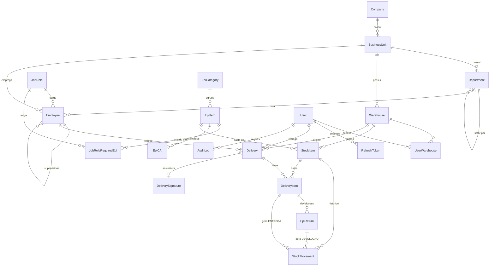

# Banco de dados

PostgreSQL 16 acessado pelo Prisma 7 (driver adapter `pg`). O schema fica em
[`database/prisma/schema.prisma`](../database/prisma/schema.prisma) e as migrations versionadas em
[`database/prisma/migrations`](../database/prisma/migrations). Tabelas e colunas usam `snake_case` no
banco (`@@map` / `@map`) e `camelCase` no código.

## Sumário

- [Diagrama](#diagrama)
- [Tabelas](#tabelas)
- [Regras garantidas pelo banco](#regras-garantidas-pelo-banco)
- [Como o saldo é mantido](#como-o-saldo-é-mantido)
- [Migrations](#migrations)
- [Seed de desenvolvimento](#seed-de-desenvolvimento)
- [Operação: backup e consultas úteis](#operação-backup-e-consultas-úteis)

## Diagrama



## Tabelas

### Acesso

| Tabela            | Para que serve                        | Campos principais                                                                                                                                                                                |
| ----------------- | ------------------------------------- | ------------------------------------------------------------------------------------------------------------------------------------------------------------------------------------------------ |
| `users`           | Quem opera o sistema                  | `email` (único), `password_hash` (bcrypt), `role` (`ADMIN`/`ALMOXARIFADO`), `active`, `token_version` (revogação), `must_change_password`, `failed_login_count`, `locked_until`, `last_login_at` |
| `user_warehouses` | Almoxarifados que cada usuário acessa | PK (`user_id`, `warehouse_id`); apaga em cascata com o usuário/almoxarifado                                                                                                                      |
| `refresh_tokens`  | Sessões (refresh token rotativo)      | `token_hash` (SHA-256, único), `expires_at`, `revoked_at`                                                                                                                                        |

### Organização

| Tabela                   | Para que serve                                     | Campos principais                                 |
| ------------------------ | -------------------------------------------------- | ------------------------------------------------- |
| `companies`              | Empresa                                            | `name`, `trade_name`, `cnpj` (único), responsável |
| `business_units`         | Unidade/obra da empresa                            | `code` (único por empresa), endereço              |
| `departments`            | Setor (hierárquico)                                | `code` (único por unidade), `parent_id`           |
| `job_roles`              | Cargo/função                                       | `name` (único)                                    |
| `job_role_required_epis` | EPIs exigidos por cargo (base para regras futuras) | (`job_role_id`, `epi_item_id`) único, `quantity`  |
| `warehouses`             | Almoxarifado de uma unidade                        | `code` (único por unidade)                        |

### Colaboradores

| Tabela      | Para que serve  | Campos principais                                                                                                                                                                                                                                     |
| ----------- | --------------- | ----------------------------------------------------------------------------------------------------------------------------------------------------------------------------------------------------------------------------------------------------- |
| `employees` | Quem recebe EPI | `registration` (única por unidade), `cpf` (único), `name`, `status` (`ATIVO`, `INATIVO`, `BLOQUEADO`, `DESLIGADO`), `badge_code` (único, aleatório, conteúdo do QR), unidade, setor, cargo, supervisor, datas de admissão/desligamento, `cost_center` |

### Catálogo

| Tabela           | Para que serve           | Campos principais                                                                                                                                                               |
| ---------------- | ------------------------ | ------------------------------------------------------------------------------------------------------------------------------------------------------------------------------- |
| `epi_categories` | Categoria do EPI         | `name` (único)                                                                                                                                                                  |
| `epi_items`      | EPI do catálogo          | `name`, `internal_code` (único), `barcode` (único), `manufacturer`, `model`, `min_quantity` (estoque mínimo), `useful_life_days` (troca prevista), `unit_price_cents`, `active` |
| `epi_cas`        | Certificado de Aprovação | `number`, `issued_at`, `expires_at`, `cancelled_at`. **Vigente** = não cancelado e `expires_at` ≥ hoje (calculado, não gravado)                                                 |

### Estoque

| Tabela            | Para que serve                         | Campos principais                                                                                                                                                                                                                                                   |
| ----------------- | -------------------------------------- | ------------------------------------------------------------------------------------------------------------------------------------------------------------------------------------------------------------------------------------------------------------------- |
| `stock_items`     | Saldo de uma variação num almoxarifado | Chave única (`warehouse_id`, `epi_item_id`, `size`, `batch_number`); `quantity` (saldo materializado); `location` (onde está guardado). `size`, `batch_number` e `location` usam **string vazia** para "não se aplica / não definido" (evita `NULL` em chave única) |
| `stock_movements` | Histórico que explica cada saldo       | `type`, `delta` (assinado), `balance_before`, `balance_after`, `reason`, `performed_by_id`, vínculo opcional com `delivery_item_id` ou `return_id`                                                                                                                  |

### Entregas

| Tabela                | Para que serve                | Campos principais                                                                                                                                             |
| --------------------- | ----------------------------- | ------------------------------------------------------------------------------------------------------------------------------------------------------------- |
| `deliveries`          | A entrega (imutável)          | `number` (sequencial, único), `idempotency_key` (única), `status`, `reason`, `reason_detail`, `notes`, colaborador, almoxarifado, responsável, `delivered_at` |
| `delivery_items`      | Itens entregues               | `stock_item_id`, `quantity`, _snapshots_ `epi_name` e `ca_number`, `size`, `batch_number`, `notes`, `expected_replacement_at`                                 |
| `delivery_signatures` | Evidência da assinatura (1:1) | `image` (PNG em `bytea`), `image_type`, `content_hash` (SHA-256), `signed_at`, IP e navegador                                                                 |
| `epi_returns`         | Devoluções (parciais)         | `quantity`, `condition` (`BOM`, `DANIFICADO`, `DESCARTADO`), `stock_item_id` (preenchido só quando volta ao estoque), `received_by_id`                        |

### Auditoria

| Tabela       | Para que serve | Campos principais                                                                                                 |
| ------------ | -------------- | ----------------------------------------------------------------------------------------------------------------- |
| `audit_logs` | Quem fez o quê | `user_id`, `action`, `entity`, `entity_id`, `before`/`after` (JSON, nunca com hash de senha), IP, navegador, data |

Ações auditadas: `LOGIN_SUCESSO`, `LOGIN_FALHA`, `LOGIN_BLOQUEADO`, `LOGOUT`, `SESSAO_REUSO_DETECTADO`,
`SENHA_ALTERADA`, `SENHA_REDEFINIDA`, `CRIAR`, `ATUALIZAR` (inclui mudança de local de estoque),
`ALTERAR_STATUS`, `ALTERAR_PERMISSOES`, `REEMITIR_CRACHA`, `CANCELAR_CA`, `ESTOQUE_ENTRADA`,
`ESTOQUE_AJUSTE`, `ENTREGA_REGISTRADA`, `DEVOLUCAO_REGISTRADA`.

## Regras garantidas pelo banco

Além de chaves estrangeiras (`ON DELETE RESTRICT` em tudo que é histórico) e índices únicos, há
`CHECK` constraints escritas à mão nas migrations. Elas valem mesmo para alterações feitas fora da
aplicação:

| Constraint                                 | Regra                                                               |
| ------------------------------------------ | ------------------------------------------------------------------- |
| `stock_items_quantity_non_negative`        | `quantity >= 0`                                                     |
| `stock_items_location_length`              | `char_length(location) <= 60`                                       |
| `stock_movements_balance_consistent`       | `balance_after = balance_before + delta`, saldos ≥ 0 e `delta <> 0` |
| `delivery_items_quantity_positive`         | `quantity > 0`                                                      |
| `epi_returns_quantity_positive`            | `quantity > 0`                                                      |
| `job_role_required_epis_quantity_positive` | `quantity > 0`                                                      |

## Como o saldo é mantido

`stock_items.quantity` é o saldo atual; `stock_movements` é o histórico que o explica. Toda mudança
de saldo passa por uma única função da API (`stock-ledger`), sempre dentro de uma transação. Uma
saída (delta negativo) é um `UPDATE` condicional:

```sql
UPDATE stock_items
   SET quantity = quantity - $n
 WHERE id = $id AND quantity >= $n
RETURNING quantity;
```

Se nenhuma linha voltar, o saldo não basta e a operação é desfeita (`ESTOQUE_INSUFICIENTE`). Entradas usam o mesmo `UPDATE` sem a condição. O lock
de linha do PostgreSQL serializa operações concorrentes sobre o mesmo item; o `CHECK` é a rede de
segurança. Em seguida é gravada a movimentação com `balance_before`/`balance_after`.

Para conferir que o histórico explica o saldo:

```sql
SELECT si.id, si.quantity,
       COALESCE(SUM(sm.delta), 0) AS soma_movimentos
  FROM stock_items si
  LEFT JOIN stock_movements sm ON sm.stock_item_id = si.id
 GROUP BY si.id
HAVING si.quantity <> COALESCE(SUM(sm.delta), 0);   -- deve voltar vazio
```

## Migrations

| Migration                       | Conteúdo                                                                                                    |
| ------------------------------- | ----------------------------------------------------------------------------------------------------------- |
| `20261006000000_init`           | Schema completo da refatoração + `CHECK` constraints                                                        |
| `20261007000000_stock_location` | `stock_items.location` (texto, padrão `''`), `CHECK` de 60 caracteres e índice (`warehouse_id`, `location`) |

Fluxo para mudar o schema:

1. Edite `database/prisma/schema.prisma`.
2. Gere a migration em desenvolvimento: `pnpm db:migrate --name descricao_curta`.
3. Se precisar de regra que o Prisma não expressa (`CHECK`, índice parcial…), **acrescente o SQL à
   mão** no `migration.sql` gerado, antes de commitar.
4. Rode `pnpm db:generate`, `pnpm --filter @epi-manager/database build` e os testes de integração
   (eles aplicam as migrations num banco limpo).
5. O CI confere se as migrations reproduzem o schema (`prisma migrate diff … --exit-code`).

Em produção, use apenas `pnpm db:deploy`. Nunca edite uma migration já aplicada em produção, e nunca
altere o banco de produção manualmente.

Recomendação: crie o banco com collation `pt_BR.UTF-8` para ordenar corretamente nomes acentuados.

## Seed de desenvolvimento

`pnpm db:seed` ([`packages/database/seed/seed.ts`](../packages/database/seed/seed.ts)) cria dados
iguais ao protótipo legado:

- empresa **EngeNova Engenharia e Construção Ltda.**, unidade **MATRIZ**, setores, cargos e o **Almoxarifado Central**;
- colaboradores de exemplo (ex.: João Carlos da Silva, matrícula 2541);
- 9 EPIs com CA vigente (Máscara PFF2, Luvas, Óculos, Protetor auricular, Respirador, Avental, Bota
  nos tamanhos 38–44, Colete) e o saldo inicial de cada um, sempre com a movimentação `ENTRADA` que o
  explica;
- locais de armazenamento de exemplo (`Corredor A · Prateleira 1` etc.);
- usuários ADMIN e ALMOXARIFADO com as senhas de `SEED_ADMIN_PASSWORD` e `SEED_ALMOX_PASSWORD`.

O seed é **idempotente** (pode rodar de novo sem duplicar nem sobrescrever dados existentes) e
**recusa rodar** com `NODE_ENV=production`.

## Operação: backup e consultas úteis

Backup e restauração (formato custom do `pg_dump`):

```bash
pg_dump  --format=custom --file=epi_$(date +%F).dump "$DATABASE_URL"
pg_restore --clean --if-exists --dbname="$DATABASE_URL" epi_2026-10-07.dump
```

A tabela `delivery_signatures` guarda as imagens das assinaturas e é a que mais cresce; inclua-a
sempre no backup, porque ela é a evidência legal das entregas.

Consultas úteis:

```sql
-- Itens abaixo do mínimo por almoxarifado
SELECT w.name, e.name, si.size, si.quantity, e.min_quantity, si.location
  FROM stock_items si
  JOIN epi_items e ON e.id = si.epi_item_id
  JOIN warehouses w ON w.id = si.warehouse_id
 WHERE e.active AND si.quantity < e.min_quantity
 ORDER BY w.name, e.name;

-- Itens com saldo e sem local definido
SELECT e.name, si.size, si.batch_number, si.quantity
  FROM stock_items si JOIN epi_items e ON e.id = si.epi_item_id
 WHERE si.quantity > 0 AND si.location = '';

-- Entregas de um colaborador (pela matrícula)
SELECT d.number, d.delivered_at, di.epi_name, di.ca_number, di.quantity
  FROM deliveries d
  JOIN employees em ON em.id = d.employee_id
  JOIN delivery_items di ON di.delivery_id = d.id
 WHERE em.registration = '2541'
 ORDER BY d.delivered_at DESC;
```
