# Guia do usuário

Manual de uso do **Controle de Entrega de EPIs** da ENGENOVA, tela a tela. Os prints usam os dados
de exemplo do ambiente de desenvolvimento.

## Sumário

- [Acesso ao sistema](#acesso-ao-sistema)
- [Navegação](#navegação)
- [Tela de início](#tela-de-início)
- [Registrar uma entrega](#registrar-uma-entrega)
- [Histórico, comprovante e devolução](#histórico-comprovante-e-devolução)
- [Estoque](#estoque)
- [EPIs e Certificados de Aprovação](#epis-e-certificados-de-aprovação)
- [Colaboradores e crachá](#colaboradores-e-crachá)
- [Usuários (ADMIN)](#usuários-admin)
- [Minha conta](#minha-conta)
- [Mensagens de erro comuns](#mensagens-de-erro-comuns)
- [Perguntas frequentes](#perguntas-frequentes)

## Acesso ao sistema

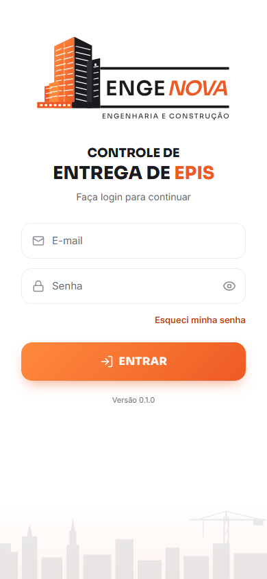

1. Abra o endereço do sistema no navegador (celular, tablet ou computador).
2. Informe **e-mail** e **senha** e toque em **Entrar**.
3. Se a senha foi criada ou redefinida pelo administrador, o sistema pede uma **nova senha** antes
   de continuar (mínimo de 10 caracteres).

**Bloqueio por tentativas:** após 5 senhas erradas seguidas, a conta fica bloqueada por 15 minutos.
O administrador pode redefinir a senha antes disso.

**Esqueci minha senha:** peça ao administrador para definir uma senha provisória. Ainda não há
recuperação por e-mail.

A sessão é renovada automaticamente enquanto o sistema estiver em uso. **Sair** encerra a sessão no
servidor e limpa os dados da tela.

 

## Navegação

| No celular                                                                                       | No computador                                                                                           |
| ------------------------------------------------------------------------------------------------ | ------------------------------------------------------------------------------------------------------- |
| Barra inferior com **Início**, **Entregas** (inicia uma nova entrega), **Histórico** e **Menu**. | Barra lateral com a logo, o botão **Nova entrega**, as seções e, embaixo, **Alterar senha** e **Sair**. |
| O **Menu** lista todas as seções, Alterar senha e Sair.                                          | A seção atual fica destacada em laranja.                                                                |

Quem tem acesso a mais de um almoxarifado escolhe o **almoxarifado ativo** na tela de início. Entregas
e estoque usam sempre o almoxarifado ativo.

## Tela de início

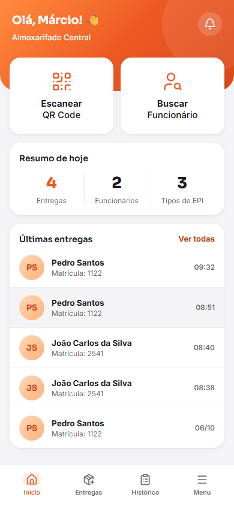

**No celular** (mesmo layout do protótipo original):

- Saudação, almoxarifado ativo e o **sino**, que leva aos itens abaixo do mínimo (com um ponto quando
  há algum).
- Atalhos **Escanear QR Code** e **Buscar Funcionário** para começar uma entrega.
- **Resumo de hoje:** entregas, funcionários atendidos e tipos de EPI entregues.
- **Últimas entregas**, com acesso ao detalhe de cada uma.

 

**No computador** a tela de início é um painel próprio:

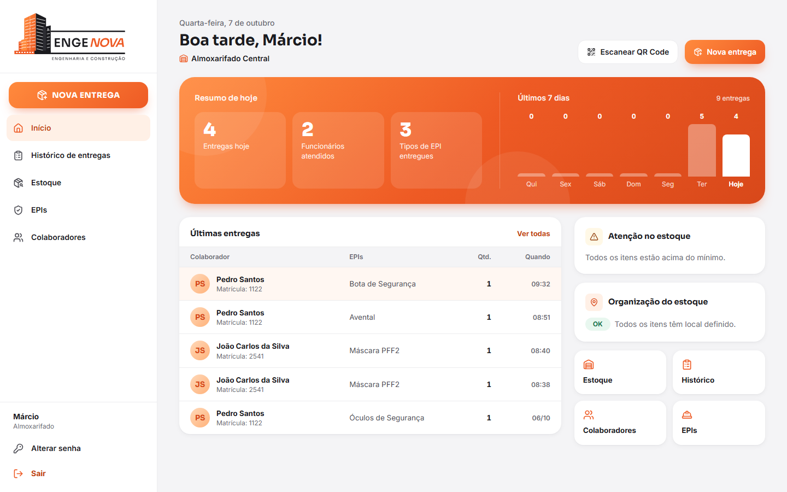

- Topo: data, saudação, almoxarifado e os botões **Escanear QR Code** e **Nova entrega**.
- Painel laranja: resumo de hoje e o gráfico de **entregas dos últimos 7 dias**.
- Tabela das **últimas entregas** (clique no colaborador para abrir o detalhe).
- **Atenção no estoque:** os itens abaixo do mínimo, com link para repor.
- **Organização do estoque:** quantos itens com saldo ainda não têm local marcado, com o atalho
  **Marcar locais**.
- Atalhos para Estoque, Histórico, Colaboradores e EPIs.

## Registrar uma entrega

O fluxo foi pensado para o celular do almoxarife, mas funciona igual no computador. A seta no topo
volta uma etapa sem perder o que já foi preenchido. **Nada é gravado até a confirmação da
assinatura.**

### 1. Identificar o colaborador

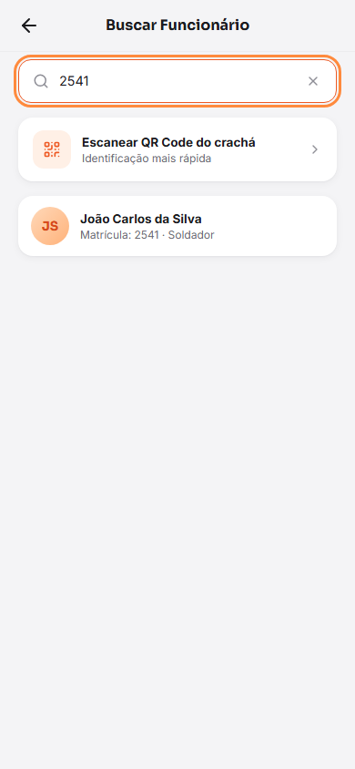

- **Pelo crachá:** toque em **Escanear QR Code** e aponte a câmera para o QR. O botão de raio liga a
  lanterna, quando o aparelho permite. Na primeira vez o navegador pede permissão para a câmera.
- **Por busca:** digite pelo menos 2 caracteres do nome ou a matrícula e toque no colaborador.

Se a câmera não abrir, use **Buscar pelo nome ou matrícula**.

 

### 2. Conferir o colaborador

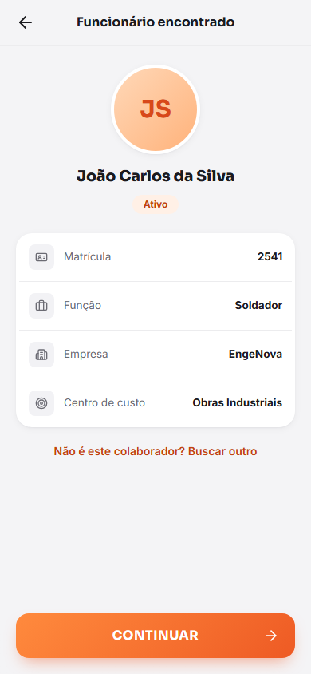

Confira foto/iniciais, nome, matrícula, função, empresa e centro de custo. Só colaboradores com
situação **Ativo** podem receber EPI; para os demais o botão **Continuar** fica bloqueado e o motivo
aparece na tela.

**Não é este colaborador? Buscar outro** volta para a busca.

 

### 3. Selecionar os EPIs

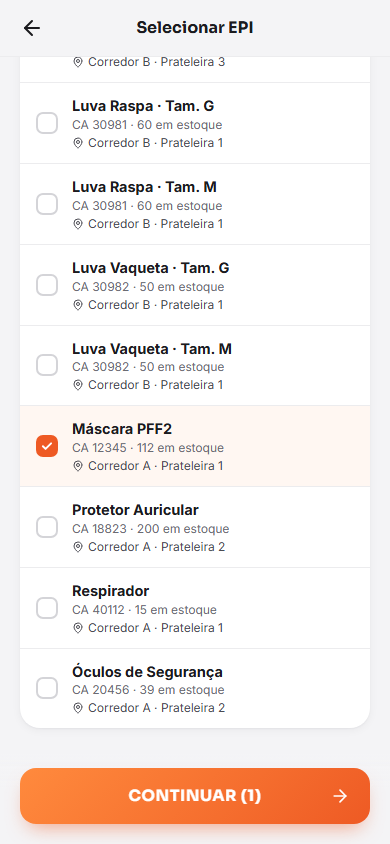

A lista mostra só itens **com saldo** no almoxarifado ativo. Cada linha traz o nome (com tamanho),
o **CA**, o saldo, o lote (se houver) e o **local onde está guardado**, para facilitar a separação.

Marque um ou mais itens. Itens **sem CA vigente** aparecem desabilitados: pela NR-6 eles não podem
ser entregues.

O botão mostra quantos itens foram escolhidos, por exemplo **Continuar (2)**.

 

### 4. Quantidade e observações

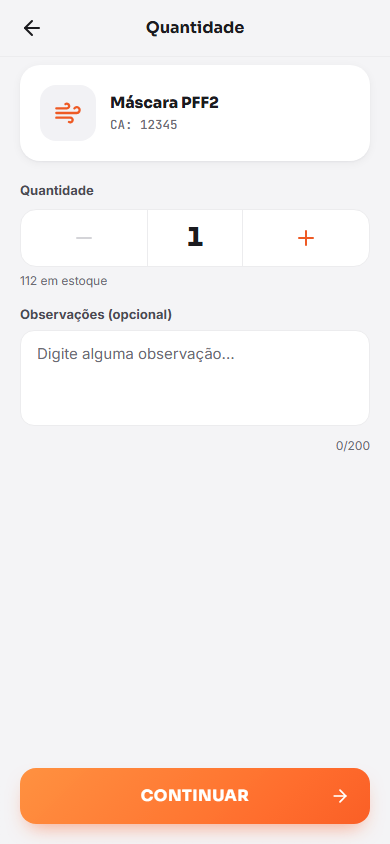

Para cada EPI escolhido, ajuste a quantidade com **−** e **+**. O limite é o menor valor entre
**50 unidades** e o saldo disponível. A observação é opcional (até 200 caracteres) e fica gravada no
item da entrega.

 

### 5. Motivo da entrega

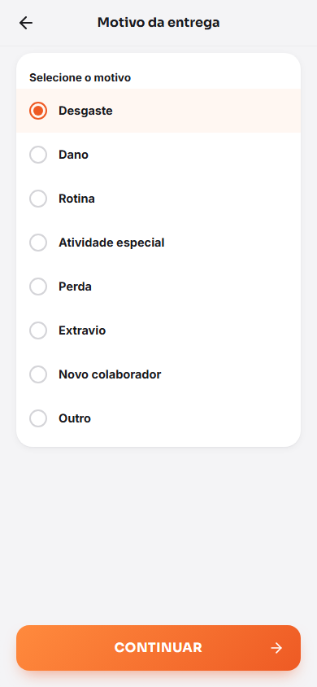

Escolha um dos motivos: **Desgaste, Dano, Rotina, Atividade especial, Perda, Extravio, Novo
colaborador** ou **Outro**. Em **Outro**, descreva o motivo (obrigatório).

 

### 6. Assinatura

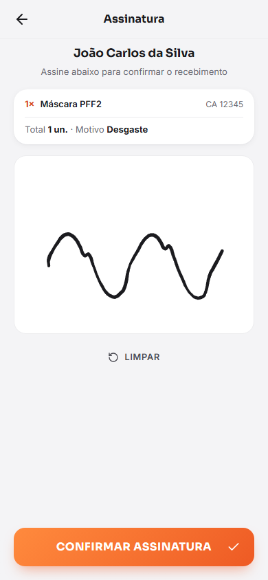

Entregue o aparelho ao colaborador. Ele confere o resumo (itens, total e motivo) e assina com o dedo
ou a caneta no quadro. **Limpar** apaga a assinatura para refazer.

**Confirmar assinatura** grava a entrega. Se outra pessoa tiver entregue o último item enquanto isso,
o sistema avisa **estoque insuficiente** e oferece **Revisar EPIs e quantidades**; nada é gravado
nesse caso.

Se a conexão cair durante o envio, basta tocar de novo em confirmar: a mesma entrega **não é
duplicada**.

 

### 7. Entrega registrada

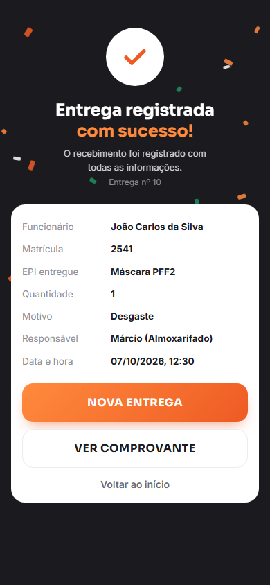

A tela de sucesso mostra os dados **confirmados pelo servidor**: colaborador, matrícula, EPIs,
quantidade, motivo, responsável e data/hora.

- **Nova entrega** começa outra entrega do zero.
- **Ver comprovante** abre o comprovante para imprimir ou salvar em PDF.
- **Voltar ao início**.

 

## Histórico, comprovante e devolução

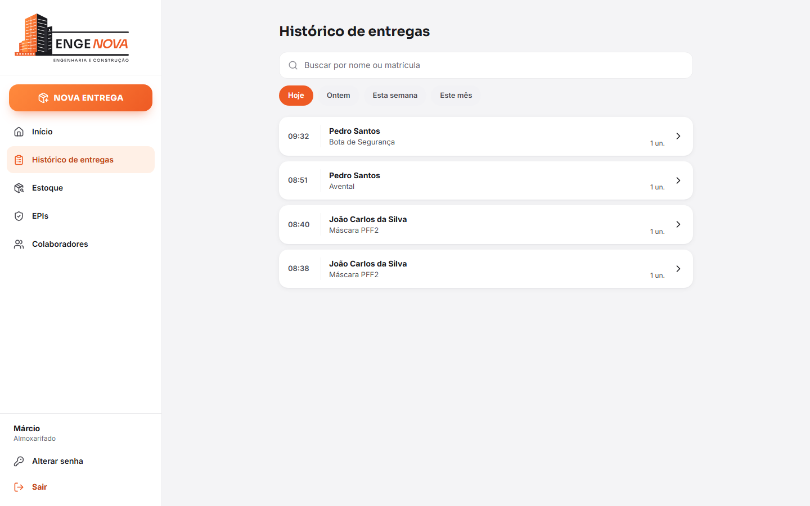

- **Histórico de entregas:** filtros **Hoje, Ontem, Esta semana, Este mês** e busca por nome ou
  matrícula. Na ficha de um colaborador, o botão **Entregas** abre o histórico só dele, sem limite de
  período (**Limpar filtro** volta ao normal).
- **Detalhe da entrega:** colaborador, motivo, responsável, almoxarifado, a **assinatura** com data e
  o **hash SHA-256**, e os itens com CA, quantidade e previsão de troca.

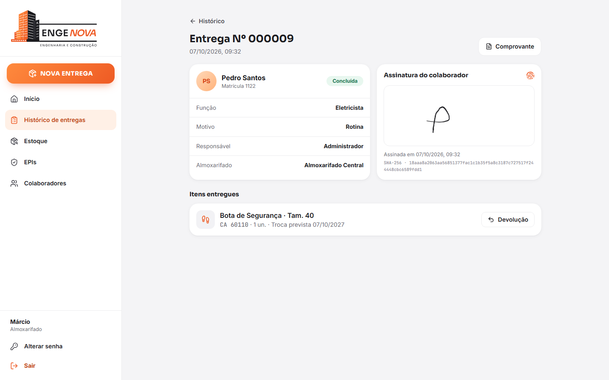

- **Comprovante:** botão **Comprovante** → **Imprimir / salvar PDF**. Traz a logo, os dados da
  entrega, os itens, a assinatura e o hash de integridade.
- **Devolução:** em cada item com quantidade pendente, **Devolução** → informe quantidade, condição e
  motivo (opcional):
  - **Bom:** a quantidade **volta ao estoque** (gera movimentação de devolução).
  - **Danificado** ou **Descartado:** fica registrado, mas não volta ao estoque.

  Não é possível devolver mais do que foi entregue. Entregas não podem ser editadas nem apagadas;
  correções são feitas por devolução.

## Estoque

O estoque é sempre o do almoxarifado ativo. Há duas abas: **Saldos** e **Movimentações**.

### Saldos por equipamento

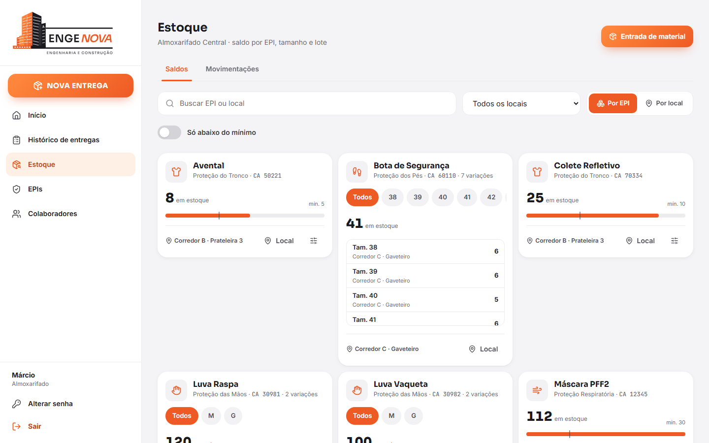

Cada equipamento aparece **uma única vez**, mesmo que tenha vários tamanhos, modelos ou lotes.

- **Tamanho:** os chips (**Todos**, 38, 39, 40…) filtram o card. Com um tamanho escolhido, o card
  mostra o saldo, o mínimo e a barra de nível daquele tamanho.
- **Modelo:** quando o mesmo equipamento tem mais de um modelo cadastrado, aparece o seletor
  **Todos os modelos**.
- Em **Todos**, o card mostra o total e uma lista por variação (tamanho/lote, local e saldo). Clicar
  numa linha seleciona aquela variação.
- A **barra de nível** mostra o saldo em relação ao mínimo (o traço marca o mínimo). Abaixo do
  mínimo, o card fica com borda e selo **Abaixo do mínimo**.
- Embaixo do card: o **local de armazenamento**, o botão **Local** e, com uma variação selecionada, o
  botão de **movimentar** (ícone de ajustes).

Filtros da página: busca por **nome do EPI, código ou local**; **Todos os locais / um local /
Local não definido**; **Só abaixo do mínimo**; e a alternância **Por EPI / Por local**.

### Local de armazenamento

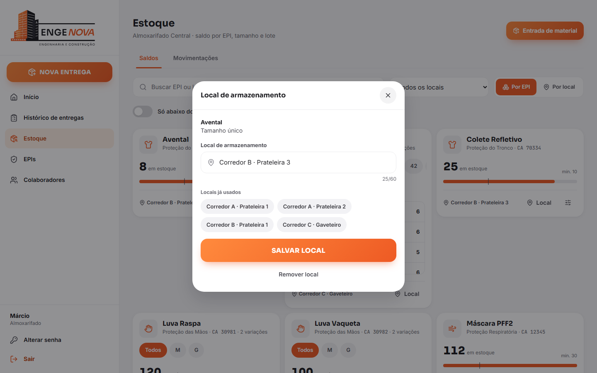

O local diz **onde o item fica guardado** no almoxarifado, por exemplo `Corredor A · Prateleira 2`
ou `Corredor C · Gaveteiro` (até 60 caracteres, texto livre).

- **Marcar ou alterar:** botão **Local** no card. Os **Locais já usados** aparecem como atalhos para
  manter os nomes padronizados.
- **Vários tamanhos de uma vez:** com **Todos** selecionado no card, o local é aplicado a todas as
  variações listadas (por exemplo, todas as botas no mesmo gaveteiro).
- **Remover local** deixa o item como "Local não definido".
- Na **Entrada de material** também é possível informar o local. Deixar em branco mantém o local
  atual.
- Toda mudança de local fica registrada na auditoria.

Itens sem local aparecem com o aviso **Local não definido**. O botão **N itens sem local**, no topo,
filtra só esses itens para organizar rapidamente.

### Visão "Por local"

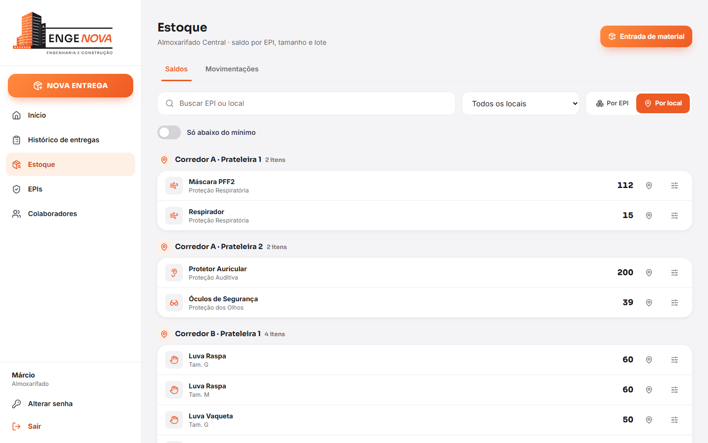

Agrupa o estoque por local (corredor/prateleira), em ordem alfabética, com **Local não definido** por
último. Funciona como lista de conferência ou de separação: cada linha tem o EPI, a variação, o
saldo e os botões para alterar o local ou movimentar.

### Entrada de material

**Entrada de material** (topo da página): escolha o EPI, informe tamanho (vazio se o EPI não tiver
grade), lote (opcional), **quantidade recebida**, **local de armazenamento** (opcional) e
documento/observação (ex.: NF 1234). Se ainda não existir item para aquele EPI + tamanho + lote, ele
é criado.

### Movimentar (ajuste, perda, avaria, saída)

No card com uma variação selecionada (ou na visão Por local), o ícone de ajustes abre **Movimentar
estoque**:

| Tipo                   | O que informar                    | Efeito                                         |
| ---------------------- | --------------------------------- | ---------------------------------------------- |
| Ajuste de inventário   | O **saldo contado** na prateleira | O sistema calcula a diferença e registra       |
| Perda / Avaria / Saída | A **quantidade retirada**         | Baixa o saldo; recusa se for maior que o saldo |

O motivo é obrigatório. O saldo **nunca fica negativo**.

### Movimentações

A aba **Movimentações** lista cada alteração de saldo com tipo, EPI, responsável, data, motivo e o
**saldo anterior → posterior**. Filtre por tipo (Entrada, Saída, Entrega, Devolução, Ajuste, Perda,
Avaria).

## EPIs e Certificados de Aprovação

- **Novo EPI:** nome, código interno, código de barras (opcional), categoria, fabricante, **modelo**,
  estoque **mínimo**, preço, **vida útil em dias** (usada para prever a troca) e links de foto/manual.
- **Editar:** os mesmos campos, além de ativar/desativar. EPI inativo não aparece para entrega.
- **CAs:** cada EPI pode ter vários CAs. O selo mostra o **CA vigente** e a validade. Para cadastrar,
  informe número, emissão e validade; **Cancelar** invalida um CA.
- **Sem CA vigente** (vencido, cancelado ou inexistente) o EPI **não pode ser entregue**.

Para o mesmo equipamento aparecer com filtro de **modelo** no estoque, cadastre os EPIs com o
**mesmo nome** e preencha o campo **modelo** de cada um.

## Colaboradores e crachá

- **Lista:** busca por nome ou matrícula e filtro por situação (padrão: Ativos).
- **Ficha:** CPF (mascarado para o almoxarifado), função, setor, unidade, empresa, centro de custo e
  datas. O botão **Entregas** mostra o histórico do colaborador.
- **Novo colaborador / Editar** (ADMIN): matrícula, CPF (validado), nome, contatos, admissão, centro
  de custo, unidade, setor, cargo e supervisor.
- **Alterar situação** (ADMIN):

  | De        | Pode ir para                  |
  | --------- | ----------------------------- |
  | Ativo     | Inativo, Bloqueado, Desligado |
  | Inativo   | Ativo, Desligado              |
  | Bloqueado | Ativo, Desligado              |
  | Desligado | Ativo (readmissão)            |

  Desligar exige a data de desligamento. Só **Ativo** recebe EPI.

- **QR Code do crachá** (ADMIN): aparece na ficha para **Imprimir**. O QR contém só um código
  aleatório (sem CPF ou matrícula). **Reemitir** gera um novo código e invalida o anterior; use quando
  o crachá for perdido.

## Usuários (ADMIN)

- **Novo usuário:** nome, e-mail, perfil (**ADMIN** ou **ALMOXARIFADO**), senha provisória e os
  almoxarifados a que tem acesso. No 1º acesso o usuário é obrigado a trocar a senha.
- **Editar:** nome, perfil, almoxarifados e ativo/inativo. Desativar ou mudar perfil/almoxarifados
  **encerra na hora** as sessões abertas do usuário.
- **Redefinir senha:** define nova senha provisória e desbloqueia a conta.

O almoxarife só vê dados dos almoxarifados vinculados ao seu usuário (e dos colaboradores das
respectivas unidades).

## Minha conta

**Alterar senha** (barra lateral ou Menu): informe a senha atual e a nova (mínimo 10 caracteres).
Trocar a senha encerra as outras sessões abertas.

## Mensagens de erro comuns

| Mensagem / situação               | O que significa                                               | O que fazer                                       |
| --------------------------------- | ------------------------------------------------------------- | ------------------------------------------------- |
| E-mail ou senha incorretos        | Credenciais inválidas                                         | Confira; após 5 erros a conta bloqueia por 15 min |
| Conta bloqueada temporariamente   | Muitas tentativas erradas                                     | Aguarde ou peça ao ADMIN para redefinir a senha   |
| Muitas tentativas                 | Limite de requisições do seu endereço atingido                | Aguarde alguns minutos                            |
| Sessão expirada                   | A sessão terminou (logout, senha trocada, usuário desativado) | Entre novamente                                   |
| Estoque insuficiente              | O saldo mudou enquanto a entrega era feita                    | Revise EPIs e quantidades                         |
| CA inválido / EPI inativo         | O CA venceu/foi cancelado ou o EPI foi desativado             | Atualize o CA ou escolha outro EPI                |
| Colaborador indisponível          | O colaborador não está Ativo                                  | Verifique a situação com o ADMIN                  |
| Devolução excede o entregue       | Quantidade maior que a pendente do item                       | Ajuste a quantidade                               |
| Não foi possível acessar a câmera | Permissão negada ou câmera em uso                             | Permita a câmera no navegador ou busque pelo nome |

## Perguntas frequentes

**Posso apagar ou editar uma entrega registrada?**
Não. A entrega é um registro legal. Use a **devolução** para corrigir.

**O sistema funciona sem internet?**
Não. Cada entrega é confirmada pelo servidor para garantir saldo e CA válidos. Se a conexão falhar
no envio, tente de novo: a entrega não é duplicada.

**Por que um EPI não aparece na seleção?**
Ele está sem saldo no almoxarifado ativo, está inativo, ou você está em outro almoxarifado. EPIs sem
CA vigente aparecem desabilitados.

**Como organizo o almoxarifado pela primeira vez?**
No Estoque, toque em **N itens sem local**, abra cada card e marque o local (com **Todos**
selecionado para aplicar a todos os tamanhos). Depois use a visão **Por local** para conferir.
